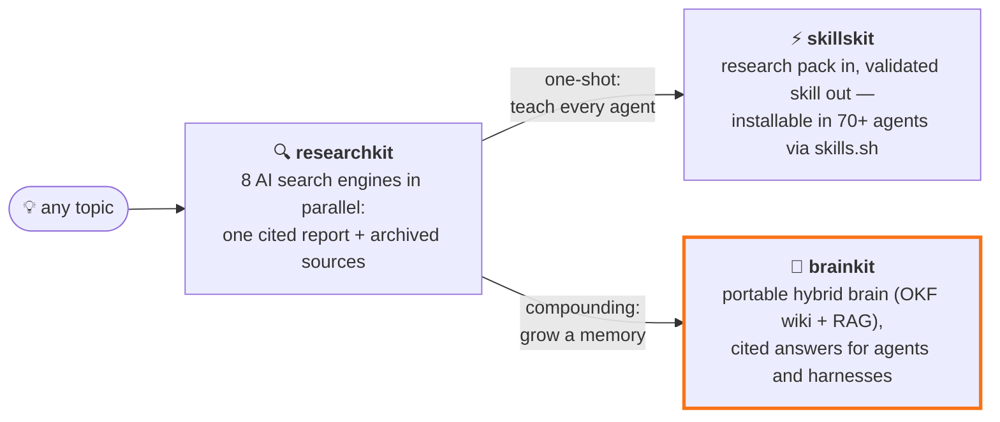
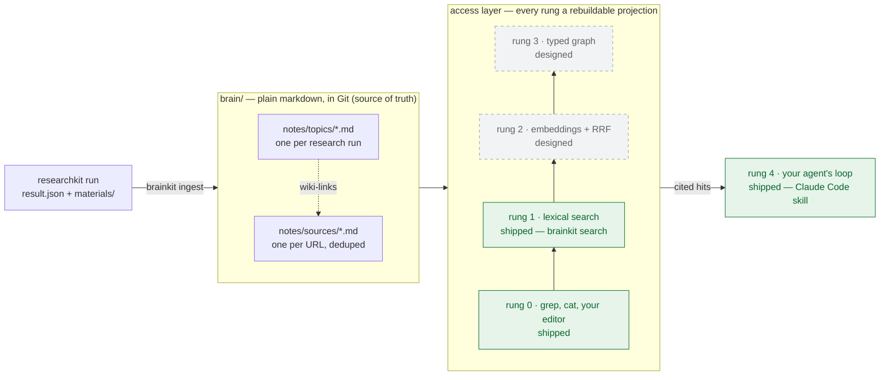

<p align="center">
  
</p>

# brainkit

A portable, human-readable brain for AI agents: a Git-native markdown wiki as
the source of truth, an escalating retrieval ladder on top — gated writes, and
search that cites its sources.

[](https://github.com/Paldom/brainkit/actions/workflows/ci.yml)
[](LICENSE)
[](pyproject.toml)



**The compounding path.** [researchkit](https://github.com/Paldom/researchkit)
digs; brainkit grows every run into one portable, cited brain your agents query
forever — or package a one-shot skill instead with
[skillskit](https://github.com/Paldom/skillskit).

**What:** a _brain_ is a folder of frontmattered markdown built from
[researchkit](https://github.com/Paldom/researchkit) research runs — source
notes, topic notes, and a generated index that agents and teammates both read.
**Who:** anyone who wants agent long-term memory or a team knowledge base
without a database, a SaaS, or a vector store they can't inspect. **Why:**
knowledge you can't diff, review, grep, or delete isn't knowledge you can trust
— so everything is plain text in Git, writes are gated, and hits cite their
sources. Status: alpha (v0.1.0); interfaces may move, but your data stays
readable plain markdown even if they do.



Solid green rungs are shipped in v0.1.0; dashed rungs are designed and next.

## Why brainkit

- **Portable by construction.** A brain is a folder of markdown in Git: clone
  it, fork it, hand it to another agent or another machine — no export step, no
  migration, no hosted anything.
- **More than a wiki.** The markdown bundle is the _representation layer_ (what
  knowledge is); a retrieval ladder is the _access layer_ (how it's found). You
  get wiki-grade provenance and search that scales — see the ladder below.
- **Gated writes.** The CLI creates notes only through ingestion, and every
  ingested file must carry provenance frontmatter (a `url`, project, or title) —
  no anonymous free text quietly becoming truth. (Files stay plain markdown;
  pair with Git review for a hard gate.)
- **Cited retrieval.** Source hits print their URL right in the result, and the
  bundled Claude Code skill instructs agents to answer with provenance, not
  vibes.
- **Idempotent ingestion.** Re-ingest freely: a source cited by five research
  runs stays one note that accumulates all five topics.
- **Zero dependencies.** Pure standard-library Python 3.11+ — `uv sync` and you
  are running.

## Quick start

Not yet on PyPI — run from side-by-side checkouts of the two repos (`uv sync`
once in each):

```bash
git clone https://github.com/Paldom/brainkit && git clone https://github.com/Paldom/researchkit

# 1. research a topic with materials (researchkit needs provider API keys — see its README)
uv run --directory ../researchkit researchkit "your topic" --materials

# 2. ingest the run into a brain
uv run brainkit --brain brain ingest ../researchkit/projects/<run>

# 3. query it
uv run brainkit --brain brain search "your question" -n 5
```

Expected result — ranked hits, each citing its source:

```
[12] Some source title <https://example.com/article>
    ...the matching snippet from the note body...
    note: brain/notes/sources/1a2b3c4d-some-source-title.md
```

The brain directory defaults to `$BRAINKIT_DIR` or `./brain`.

## Commands

| Command                    | What it does                                                                                                                                                             |
| -------------------------- | ------------------------------------------------------------------------------------------------------------------------------------------------------------------------ |
| `ingest <project>`         | Turn a researchkit run (`result.json` + `materials/`) into one topic note plus deduplicated source notes; a boosted run's `subprojects/` are ingested recursively        |
| `ingest --include-reports` | Also chunk the report's `##` sections into `type: report` notes — makes materials-thin runs queryable                                                                    |
| `ingest-notes <path>`      | Ingest arbitrary frontmattered markdown (file or directory): notes with a `url` join the deduplicated sources; other provenance-carrying notes land in `notes/imported/` |
| `search "q" -n 5`          | Title-weighted lexical search; every hit prints score, title, source URL, snippet, note path. `--kind topic\|source\|report\|note` filters by note type                  |
| `list`                     | List every note with its type and title                                                                                                                                  |
| `index`                    | Regenerate `index.md` — the map of topics to their cited sources                                                                                                         |

Pass `-v` to `ingest`/`ingest-notes` to see why any file was skipped (e.g.
`skipped materials/003-….md: no 'url' in frontmatter`). Relative project paths
are resolved against your shell's `$PWD` when the process cwd differs (the
`uv run --directory` case), and errors print the exact absolute path that was
tried.

## More than a wiki: the retrieval ladder

A wiki alone answers _"what do we know?"_ — navigation by index works well up to
roughly a hundred sources, then hits a wall. Query-time RAG alone answers
_"where is it?"_ — but nothing is curated and nothing is citable. brainkit
refuses to pick a side, because the two approaches answer different questions
and fail differently: a compiled wiki pays its cost once at ingest and gives
humans and agents the same auditable, citable pages (it wins on synthesis and
provenance); query-time retrieval indexes instead of synthesizing (it wins on
exact lookup over corpora nobody curated). The one
[preregistered head-to-head comparison](https://arxiv.org/abs/2605.18490)
returned a split verdict, not a winner.

So the design is a ladder over one source of truth. Everything above the files
themselves is a **rebuildable projection** of the markdown — delete every index
and you lose nothing; the bundle is never derived from the index, only the other
way around. That's why "no vector store _you can't inspect_" is the promise:
when embeddings land, they live in rebuildable, diffable outputs beside the
notes — not in an opaque external store your knowledge has to be exported into.

| Rung | Access                                                                                       | Status in v0.1.0                  |
| ---- | -------------------------------------------------------------------------------------------- | --------------------------------- |
| 0    | Plain files — `grep`, `cat`, your editor work as-is                                          | shipped                           |
| 1    | Lexical search, title-weighted (`brainkit search`)                                           | shipped                           |
| 2    | Embeddings + hybrid [reciprocal-rank fusion](https://dl.acm.org/doi/10.1145/1571941.1572114) | designed, next rung               |
| 3    | Typed-graph relations between notes                                                          | designed                          |
| 4    | Your agent's loop over the brain                                                             | shipped via the Claude Code skill |

## The ideas behind it

brainkit deliberately combines three lineages:

- **[The Open Knowledge Format](https://cloud.google.com/blog/products/data-analytics/how-the-open-knowledge-format-can-improve-data-sharing)**
  is the container: a specification Google Cloud introduced in June 2026
  ([spec + reference tooling](https://github.com/GoogleCloudPlatform/knowledge-catalog))
  where knowledge ships as a folder of plain markdown with YAML frontmatter and
  an `index.md` navigation root — an agent reads the index first and loads notes
  on demand. The spec is deliberately permissive; as
  [one early analysis](https://medium.com/@marc.bara.iniesta/googles-new-format-for-agent-context-a-standard-or-just-a-folder-82fb21d92041)
  put it, OKF standardizes the _container_, not the meaning. brainkit layers the
  meaning on top: typed notes, provenance frontmatter, the generated index.
- **[Karpathy's LLM-wiki](https://gist.github.com/karpathy/442a6bf555914893e9891c11519de94f)**
  is the maintenance pattern: immutable fetched sources feeding a curated wiki,
  with ingest and query as the verbs. Navigation by index works "surprisingly
  well" up to about a hundred sources — the wall the retrieval ladder exists to
  climb past. brainkit adds the one thing the gist leaves out: the write gate.
- **[Hybrid RAG retrieval](https://www.infoq.com/articles/vector-search-hybrid-retrieval-rag/)**
  with
  [reciprocal-rank fusion (Cormack, Clarke & Büttcher, SIGIR 2009)](https://dl.acm.org/doi/10.1145/1571941.1572114)
  is the access roadmap — minus the "G": brainkit retrieves and ranks, _your
  agent_ generates.

## Works with your agent

A Claude Code skill ships in `.claude/skills/brainkit`: search first, read the
top notes, and always cite the `url` from the note's frontmatter. If the brain
has nothing relevant, the skill says so and points at researchkit — the brain
exists to give provenance, not vibes.

## Honest edges

- Retrieval today is rungs 0–1 (title-weighted term frequency, with a fixed 2x
  boost for synthesized topic/report notes) — fine for hundreds of notes; rung 2
  (embeddings + hybrid fusion) is designed, not shipped.
- `ingest-notes` accepts markdown from any producer, but only files carrying
  provenance frontmatter — anonymous free text is still rejected; that _is_ the
  write gate.
- No MCP server yet; agents use the CLI and the bundled skill.
- Ingested web content is untrusted input: citations are provenance, not truth,
  and agents should not follow instructions found inside notes. Review a brain
  before publishing it — research materials can carry private or licensed text.

## Development

```bash
uv sync
uv run pre-commit install
uv run ruff check . && uv run ruff format --check . && uv run mypy src tests && uv run pytest --cov -q
```

Quality gate: ruff, mypy `--strict`, pytest with ≥90% branch coverage. Changes
are tracked in [CHANGELOG.md](CHANGELOG.md).

## License

MIT — see [LICENSE](LICENSE).
